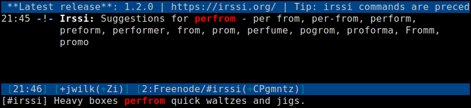

=======================
Spell-checker for Irssi
=======================

Requirements
~~~~~~~~~~~~

* `Irssi`_ 0.8.12 or newer
* `GNU Aspell`_ with appropriate dictionaries
* Perl module `Text::Aspell`_

.. _Irssi:
   https://irssi.org/
.. _GNU Aspell:
   http://aspell.net/
.. _Text::Aspell:
   https://metacpan.org/release/Text-Aspell

Description
~~~~~~~~~~~
Works as you type, printing suggestions when Aspell thinks your last
word was misspelled. It also adds suggestions to the list of
tab-completions, so once you know last word is wrong, you can go back
and tab-complete through what Aspell suggests.

.. <git> (don't include in release tarballs)

.. </git>

Settings
~~~~~~~~

``spellcheck_languages``
   A list of space or comma separated languages to use on certain
   networks/channels.

   For example::

       /SET spellcheck_languages netA/#chan1/en_US,#chan2/fi_FI,netB/!chan3/pl_PL

   will use:

   * ``en_US`` for ``#chan1`` on network ``netA``,
   * ``fi_FI`` for ``#chan2`` on every network,
   * and ``pl_PL`` for ``!chan3`` on network ``netB``.

   You can use ``und`` as language code to disable spellchecking.

   For multilingual channels, you can combine language codes with
   ``+``. For example, ``en+de`` will accept both English and German
   words.

   By default this setting is empty.

``spellcheck_default_language``
   Language to use in empty windows, or when nothing from
   ``spellcheck_languages`` matches.

   The default is ``en_US``.

``spellcheck_enabled`` [``ON``/``OFF``]
   Enable or disable spellchecking globally.

   Sometimes (like when pasting foreign-language text), you don't want
   the script to spit out lots of suggestions, and turning it off for a
   while is the easiest way.

   The default is ``ON``.

``spellcheck_print_suggestions`` [``ON``/``OFF``]
   Enable or disable printing out the spelling suggestions.

   The corrections are still added to the tab completion in case the
   printing is disabled.

   The default is ``ON``.

``spellcheck_word_color``
   Highlight misspelled word to this color.

   The default is ``%R`` (red).

``spellcheck_word_input_color``
   Highlight misspelled words inside the input prompt in this color.

   The default is ``%U`` (underline).

   Available on Irssi 1.2.0 and later.

Corrections in a split window
^^^^^^^^^^^^^^^^^^^^^^^^^^^^^
As an experimental feature, it is possible to display corrections in a
separate split window:

``spellcheck_window_name``
   Name of the window.

``spellcheck_window_height``
   Height of the window.

   The default is 10.

It's the user's responsibility to create the window::

   /WINDOW NEW SPLIT
   /WINDOW NAME <name>
   /WINDOW STICK OFF
   /WINDOW HIDE

Commands
~~~~~~~~

``/SPELLCHECK_ADD <word>...``
   Add word(s) to personal dictionary.

Bugs
~~~~

Known issues:

* Picking actual words from what you type is very kludgy, you may
  occasionally see some leftovers like digits or punctuation
* Works every time you press space or an end mark (``.``, ``!`` or
  ``?``). It won't work for the last word before pressing enter unless
  you're using proper punctuation at the end of your sentences.
* When you press space and realize that the word is wrong, you can't
  tab-complete to the suggestions right away — you need to use backspace
  and then tab-complete. With dot you get an extra space after
  tab-completion.

Please report bugs to the `issue tracker`_.

.. _issue tracker:
   https://github.com/jwilk/irssi-spellcheck/issues

.. vim:ft=rst ts=3 sts=3 sw=3 et tw=72
